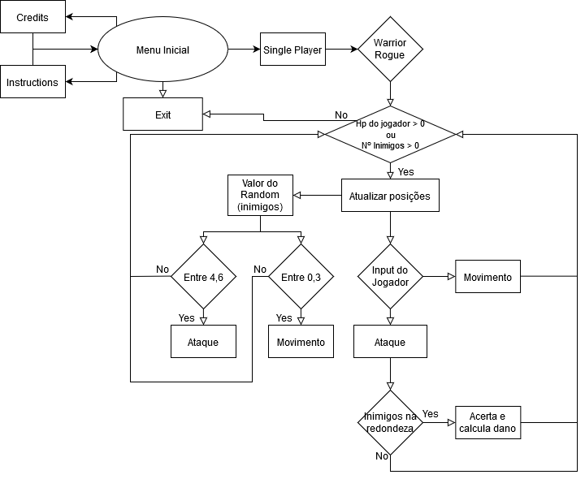

# Diabo - 2º Projeto de Linguagens de Programação II 2019/2020

O código fonte situa-se [neste](https://github.com/JBernardoRebelo/Projeto2_LPII_Fernandez_Rebelo) repositório público.

## Autores

### *[João Rebelo - a21805230](https://github.com/JBernardoRebelo)*

- Aplicação do *Game Engine* na criação no jogo.
- Geração procedimental da *dungeon* e colocação de respetivos
componentes na mesma tal como a sua renderização.
- Criação de classes que compõem o jogo.
- Ficheiro README, UML e Fluxograma.
- XML das classes do jogo.

### *[Miguel Fernández - a21803644](https://github.com/MizuRyujin)*

- Implementação, manutenção e alteração do funcionamento de classes
do *Game Engine*.
- Comportamento dos inimigos.
- Controlador do jogador.
- XML do *Game Engine*. *Doxyfile*.

## *Design Patterns* utilizados

Os *Design Patterns* utilizados foram:

- *GameLoop*
- *Update*
- *Component*
- *Composite*
- *Observer Pattern*

### Explicação:

As *Scenes* de jogo têm um método `GameLoop()`, este gere o ciclo de jogo
chamando todos os `GameObject` que se inserem nesta e ativando os seus
métodos `Update()`, que dependendo da função do `GameObject` em questão, vão
agir de acordo com isso (pois todos os métodos `Update()` vão ser
específicos ao seu objeto), por consequência, os `GameObject` ativam o
`Update()` dos respetivos `Compoment` (componentes).

O *Composite Pattern* está a ser aplicado na criação de `Dungeon`, esta
contem as respetivas salas, que por sua vez contém as respetivas portas e
inimigos com as respetivas instanciações.

O *Observer Pattern* é utilizado pelas classes `Quiter` e
`PlayerController`, para ler e utilizar eficientemente o *input*.

As classes `PlayerController` e `EnemyController` são componentes que
complementam os `GameObject` pai controlando o *input* (no caso do *player*)
 e o comportamento artificial (no caso dos inimigos). Estas classes também
 são exemplos de alguns dos componentes que compõem um `GameObject` e gerem
 o seu funcionamento.

### Diagrama UML

### Fluxograma

## **Implementado:**

- Implementação o *GameLoop* e o *Update Method*.
- Duas *threads*: a thread principal do jogo (que executa o *GameLoop*) e
uma *thread* para ler *input* do utilizador.
- Mecânicas base do jogo original:
  - Movimento ´WASD´;
  - 1 Ataque *skill*;
  - 1 Inimigo atacável que ataca;
  - 1 *dungeon* explorável gerada procedimentalmente;
  - XP que se ganha ao matar inimigo e sistema de níveis e stats que se
incrementam;
  - Ecrã inicial com opção no menu onde são explicadas as regras e
 indicados os controlos do jogo;
  - Menu de escolha de classes com 2 classes,  *warrior* e *rogue*;

## **Instruções:**

- Escrever "credits" ou 'c' para os creditos;
- Escrever "exit" ou 'e' para sair; 
- Pressionar qualquer tecla no menu inicial para começar:
  - Escrever o nome da classe desejada;
  - De seguida o nome do jogador;
- No jogo:
  - Atacar inimigos para ganhar XP e subir de nível;
  - Eliminar todos os inimigos causa vitória e morrer causa derrota;

### Controlos

- 'WASD' para mover o personagem;
- 'Space' para atacar;
- 'C' para mostrar detalhes do personagem;
- 'E' para abrir portas e entrar na respetiva sala;
- Escrever a opção pretendida para navegar dentro de menus;

### **Mecânicas omitidas que fasem parte do jogo base**

- Sistema de inventário e Lojas/Transações de Gold
  - De momento só existe 1 item possível e é a _Short Sword_ usada para atacar;
- Classe _Sorcerer_;
- Restantes _stats_ de classe;
- Interações e existência de NPC's;
- Controlo e ataque de jogador com rato (utilizar o teclado pareceu mais prático de implementar);

## Referências

- Conversas com os alunos André Vitorino e Rodrigo Pinheiro sobre problemas 
relacionados com *colliders*.

- Game Engine baseado no que o professor Nuno Fachada disponibilizou. 

### Bibliografia

- Nystrom, R. (2014). Game Programming Patterns. Genever Benning.

### *[.NET API](https://docs.microsoft.com/en-us/dotnet/api/?view=netcore-2.2)*

- *[Vector2 Struct](https://docs.microsoft.com/en-us/dotnet/api/system.numerics.vector2?view=netframework-4.8)*
- *[Finalizers ](https://docs.microsoft.com/en-us/dotnet/csharp/programming-guide/classes-and-structs/destructors)*
- *[GC.Collect Method](https://docs.microsoft.com/en-us/dotnet/api/system.gc.collect?view=netframework-4.8)*

### *[Stack overflow](https://stackoverflow.com/)*

- *[Remove Item in Dictionary based on Value](https://stackoverflow.com/questions/1636885/remove-item-in-dictionary-based-on-value)*
- *[Detect collision between a moving object and an immobile one](https://stackoverflow.com/questions/3195495/detect-collision-between-a-moving-object-and-an-immobile-one)*
- *[Destroy an object in C#](https://stackoverflow.com/questions/25764965/destroy-an-object-in-c-sharp/25765055)*
